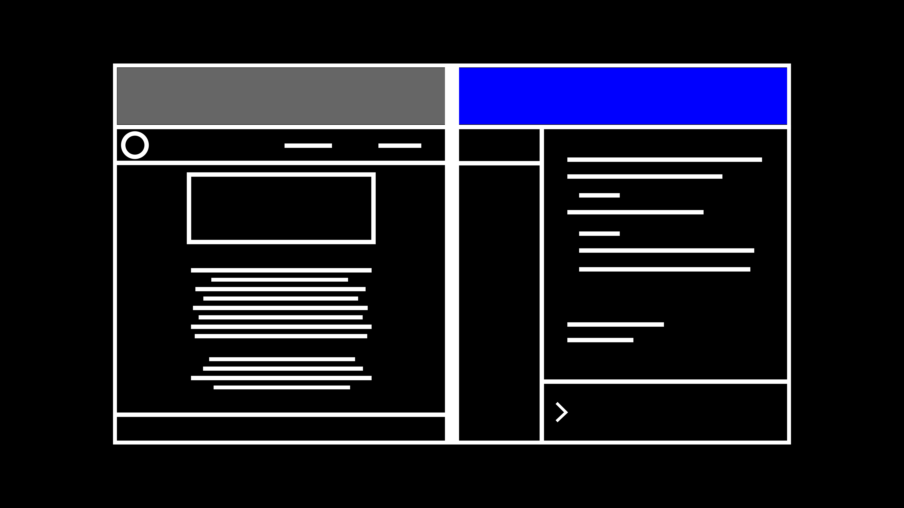
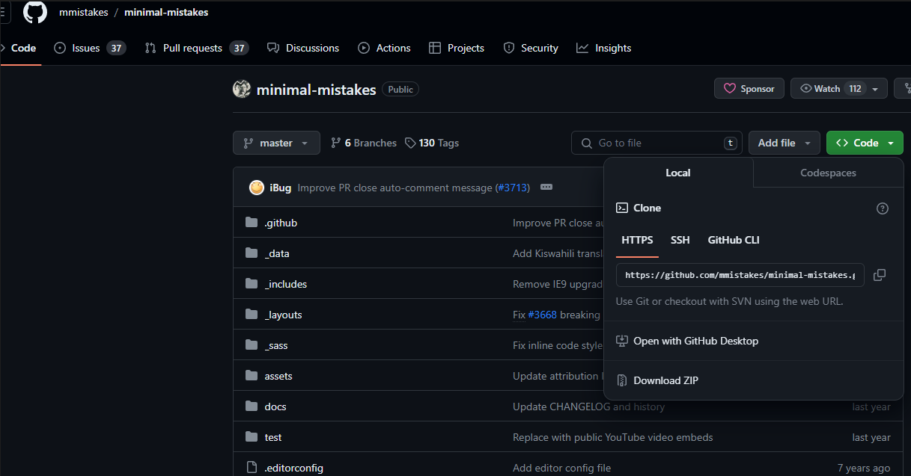
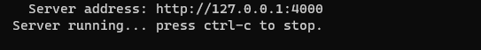
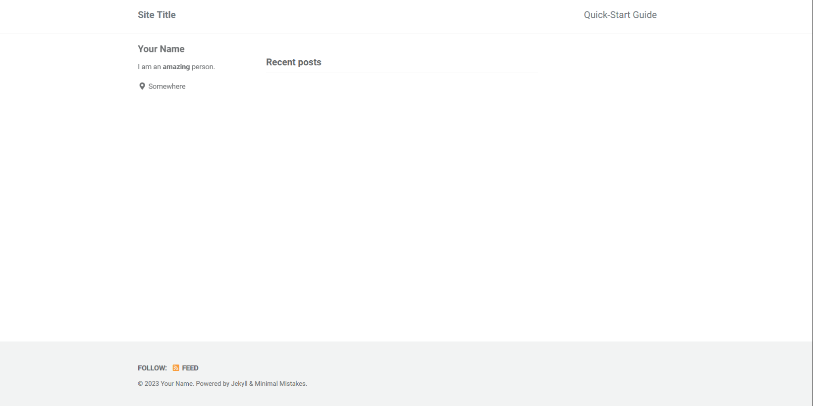
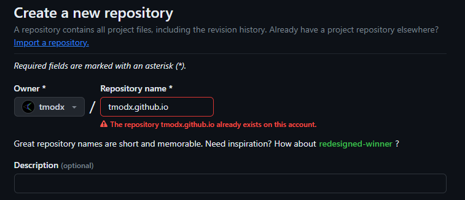
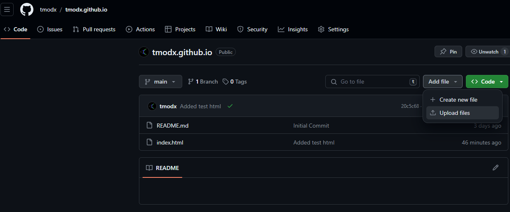
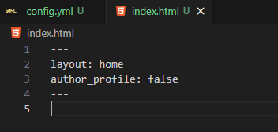
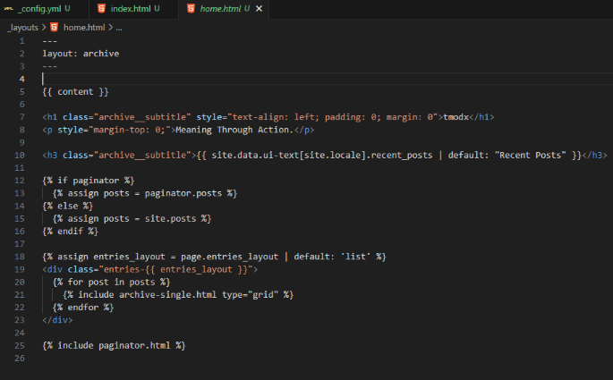

Building a website will inevitably involve a learning curve. The more you want to customize, the more you'll have to learn. This guide is designed to give you a roadmap for the steps I followed to build my website. I will not spell everything out. I will link you to further guides and help resources. If you are new to the tools we will be using, expect to spend time learning and iterating as you build the website.

To host our website, we're going to use [GitHub Pages](https://pages.github.com/). It will handle hosting static websites provided the code needed to run the website. GitHub is widely used and well-trusted. A static website means that it can't update while running. This will be fine for most purposes.

To help us build the website, we'll use [Jekyll](https://jekyllrb.com/), which is designed to handle static sites and blogs, converting files with text into new posts. This will allow us to easily add new content later in the form of .markdown files.

# Setup

Here is what we'll need to setup to build the website.

1. A [GitHub](https://github.com) account to host our website.
   - Optional: although we could do without it, it will also be helpful to have [Git](https://git-scm.com/) to interface with GitHub and control site development later.
2. A text editor to write code, I recommend [Visual Studio Code](https://code.visualstudio.com/).
3. [Install Jekyll](https://jekyllrb.com/docs/installation/).
4. A browser to see the website.

# Template Site

While we could build the website from scratch, it would take much more time and effort. Instead, we'll start with a [Jekyll theme](https://jekyllthemes.io/free), which will act as template code that we customize from. A theme is essentially a preset for our website's style, and we can be efficient by picking one that closely resembles the website we want. I used the [Minimal mistakes](https://jekyllthemes.io/theme/minimal-mistakes) theme as a starter for my website.

Head to the GitHub repository for your theme of choice and download as a ZIP and extract it



or clone it from the terminal into a folder with the repository URL.

```bash
git clone https://github.com/mmistakes/minimal-mistakes
```

Now you should be able to build the default theme website from the terminal in the folder where you downloaded the code.

```bash
jekyll serve
```

This will build the website on the local machine.


We can then go to that address in a browser to see the website.


# Hosting the Template

Start by creating a GitHub repository to host your code. Ensure that you name it "\[username\].github.io". This is how GitHub knows to host the website on GitHub Pages under the domain "https://[username].github.io."



Before adding your code to the repository, remove the .git/ and .github/ folders and anything else you don't want, such as LICENSE, CHANGELOG.md, and README.md. The .git/ and .github/ folders keep track of the changes that occur on the project. Since this is a new project, we don't need them.

Now add your files by uploading them:


Or through the command line:

```bash
git init
git add .
git commit -m "first commit"
git remote add origin https://github.com/username/username.github.io.git
git branch -M main
git push -u origin main
```

You should now be able to see your hosted website on https://[username].github.io

# Customizing the Website

Now that we have a working website running, we're free to customize it and build as we want, since all the code for the website is in the repository we just set up. Here's the process for customizing the new website:

1. Edit the code.
2. Test the site locally (using jekyll serve).
3. Upload the website to GitHub.

This part of the guide is the most open-ended because the direction you go from here depends on what you want to do with your website. Depending on how much you want to change, you might need to know about all the inner workings of your theme, or none of it. Here I'll outline the main structure of the project as well as what to change to build your website.

## Structure

Here's what the main structure of the project should look like:

.

├── \_data/

├── \_includes/

├── \_layouts/

├── \_pages/

├── \_posts/

├── \_sass/

├── \_site/

├── assets/

├── \_config.yml

├── 404.html

├── Gemfile

├── Gemfile.lock

└── index.html

These files and folders do the following:

- `_data/`: Holds data about the project in `.yml` files; it's like an extension of `_config.yml`.
- `_includes/`: Contains reusable code snippets or components that can be included in different pages or layouts. It's like the backbone of the extension.
- `_layouts/`: Holds layout templates for each page on your website.
- `_pages/`: Stores additional pages on the website
- `_posts/`: Contains blog posts or other content organized by date.
- `_sass/`: Houses Sass stylesheets that can be imported into the main stylesheet.
- `_site/`: Automatically generated by Jekyll to store the processed site.
- `assets/`: Stores static assets like images, CSS, or JavaScript files.
- `_config.yml`: Configuration file for Jekyll, where you can set various options for your site.
- `404.html`: The custom 404 error page.
- `Gemfile`: Specifies the Ruby gems/modules needed for the project.
- `Gemfile.lock`: Lock file for the dependencies specified in `Gemfile` to ensure consistent installations.
- `index.html`: The main entry point or homepage of the site.

## Customizing

Usually, `_config.yml` will be the easiest to start customizing, since many themes have pre-built options. For example, this line lets me choose from preset color skins (I added my own).


To further understand how the website works, you can trace backwards from index.html


We can see that in the front matter (between the "---"s), the website imports the "home" layout. We can see how this works in `/_layouts/home.html`



We can see that this layout actually draws from another layout: archive. Also, there is some html content in this layout (the <\h1>, <\p>, ... tags) as well as Liquid (the things inside the "{}"). You can change these to see what they are doing, or learn the basics of the programming language used to understand what is going on.

We can continue tracing this on and on, but remember that our focus is on getting a working version of the website as soon as possible, knowing that we'll be forced to learn about the project by doing that. Look things up, teach yourself, ask AI to teach you what certain parts are doing. And then test, iterate, and pivot until your website is ready for deployment.

# Resources

### Hosting and Development

- [GitHub Pages](https://pages.github.com/)
- [Jekyll](https://jekyllrb.com/)
- [Git](https://git-scm.com/)
- [Visual Studio Code](https://code.visualstudio.com/)

### Jekyll Themes

- [Jekyll Themes](https://jekyllthemes.io/free)
- [Minimal Mistakes Theme](https://jekyllthemes.io/theme/minimal-mistakes)
- [Beautiful Theme](https://jekyllthemes.io/theme/beautiful-jekyll)
- [Mediator Theme](https://jekyllthemes.io/theme/beautiful-jekyll)

### Setup

- [Jekyll Installation Guide](https://jekyllrb.com/docs/installation/)
- [Git Setup](https://git-scm.com/book/en/v2/Getting-Started-First-Time-Git-Setup)
- [GitHub Quickstart](https://docs.github.com/en/get-started/quickstart)

### Programming

- [Liquid Templating Language](https://shopify.github.io/liquid/)
- [HTML Tutorial](https://www.w3schools.com/html/)
- [CSS Tutorial](https://www.w3schools.com/css/)
- [JavaScript Tutorial](https://www.w3schools.com/js/)
- [Ruby Introduction](https://www.ruby-lang.org/en/documentation/quickstart/)

### Learning and Problem Solving

- [ChatGPT](https://chat.openai.com/)
- [Stack Overflow](https://stackoverflow.com/questions)
