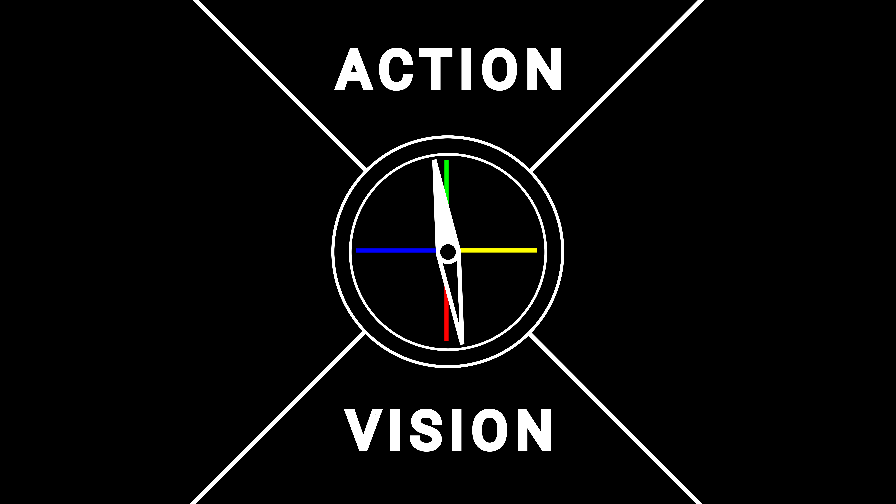

Regardless of your beliefs and circumstances, your life is filled with action.

You get fulfillment from your actions when they have a purpose.

To act with purpose, there are 4 things you must understand about action:

1. Life is marked by action.
2. Action changes your state of being.
3. Change follows a direction along the dimensions with which it is concerned.
4. Purposeful action is achieved by creating a multidimensional ideal (vision) aligned with our deepest beliefs and committing our actions to move toward it.

Let's break each of these down.

1. **Life is marked by action.**

   There are certain actions required to maintain the human condition. Eating, breathing, and sleeping are examples present in every lifestyle. Beyond this are actions we add because of habits, environmental influences, and internal ones.

   It is impossible not to take any action. In other words,

   *everything is an action*.

   Sitting on the floor is an action, so is thinking, breathing, sleeping, and trying not to take action.

   If you are alive, you are taking action
2. **Action always involves change.**

   > "Life is flux." - Heraclitus
   >

   Just as action is unavoidable, so too is the change associated with it.

   Take, for example, the act of sitting on the floor. In doing so, you alter your immediate surroundings. The distribution of weight, the flow of air you breathe — these are all changes, albeit seemingly small. Inside, unconscious biological processes continue to take place, changing you regardless of the circumstance. The act of thinking initiates changes in neural patterns and synaptic connections. Making a decision can split your life trajectory along a wildly diverging path.

   Each action you take will initiate change, as such, purpose in action comes from taking the actions whose changes align with our vision.
3. **Change follows a direction along the dimensions with which it is concerned.**

   This is a fancy way of saying that we can measure change.

   Say you're eating a bowl of spaghetti. We can create a "dimension" of measurement for how full the bowl is and how full you are. When you take the action of eating, the bowl's "fullness" changes in the direction of being empty, and your stomach changes in the direction of fullness.
4. **Purposeful action is achieved by creating a multidimensional ideal (vision) aligned with our deepest beliefs and committing our actions to move toward it.**

   Measuring change is important because it means you can set goals.

   Your vision represents a collection of ideas you have about the future. It's your goals, dreams, hopes, aspirations, fears, worries, and so on. Each of these has locations along the dimensions we looked at earlier, which means you can choose actions that move you towards these ideals.

   Your vision forms an internal compass which points you in the direction of your goals. This compass is accessed through asking "what should I do" from the context of your vision. In the beginning, you should be asking yourself this quite a lot. Over time, habits will develop, you will ask yourself less, and you should see progress towards your vision.

   

   If you are not asking yourself this, it is because your life is too full of distractions for your mind to have time to question itself. You will need to remove these distractions to change. Prepare yourself for boredom. If necessary, force yourself into it.

   Lastly, choose goals that align with your beliefs. If you don't do this, you can build internal conflicts and cognitive dissonance between your beliefs and visions.

**Bonus:  As the foundations of our action, our beliefs should stand resilient through challenge and expansion of the mind.**

   Expanding your mind through learning exposes you to new potentials for your vision, building confidence in your current one. This means that you might find information conflicting with your current vision. At that point you need to pivot and adjust your vision. Don't get stuck trying to learn everything about your vision. You can't change it if it doesn't exist. The knowledge you need to adjust it might  not be accessable until you work toward your goal. Don't procrastinate by looking for the perfect goals.

   This also serves as a test for the beliefs which make the foundation of your vision and progress. If your beliefs and vision cannot withstand challenge and new knowledge, it is time to change them.

# Creating a Vision

As we discussed before, creating a vision involves aligning it with your beliefs.

"But I have no beliefs."

I can almost guarantee that you do. Your mind requires a set of beliefs to act as filters for the information it receives in this world.

You can probe your beliefs, regardless of whether you think you have them, using evidence and your intuition. Take your time with this. This will show you how you view the world.

- What actions do you perform each day? If you don't know, track what you do for the next 24 hours. Write it down or you will forget.
- See what option jumps out at you next time you make a decision.
- Read about moral dilemmas and see what option "feels right."
- Look for discrepancies between your intuition and your thoughts about a question. For example, why does your life suck and why is it all your fault? You might rationally respond "that isn't true," but see if your gut feeling argues otherwise.

With an understanding of your beliefs, you can then go on to probe your intuition and thoughts about your vision.

- What does your day look like in a world where you have infinite money?
- What is the worst day you could imagine.
- Imagine the wisest version of yourself, how would they tell you to live?
- Imagine a world where you have achieved all your goals. What do you do next?
- What is your ideal health condition?
- Who is in your life? How do you interact with people?
- What are the earliest activities that you can remember enjoying?

When you get ideas for the future, trace their origin. Where did these desires form in your mind? Let go of ideas that have shallow origins or that don't align with your beliefs. For example, don't envision exercise because you saw someone who looked stronger than you out on the street. Remember, this is how you want to live your life.

Again, take your time, you will need it. Clear 1-2 full days for this if you can.

Write things down, you won't remember.

Turn off noise and distractions to think more clearly. No TV, no phone, no computer. They can't tell you how you want to live.

Once you have your vision, it's time to get to work.
